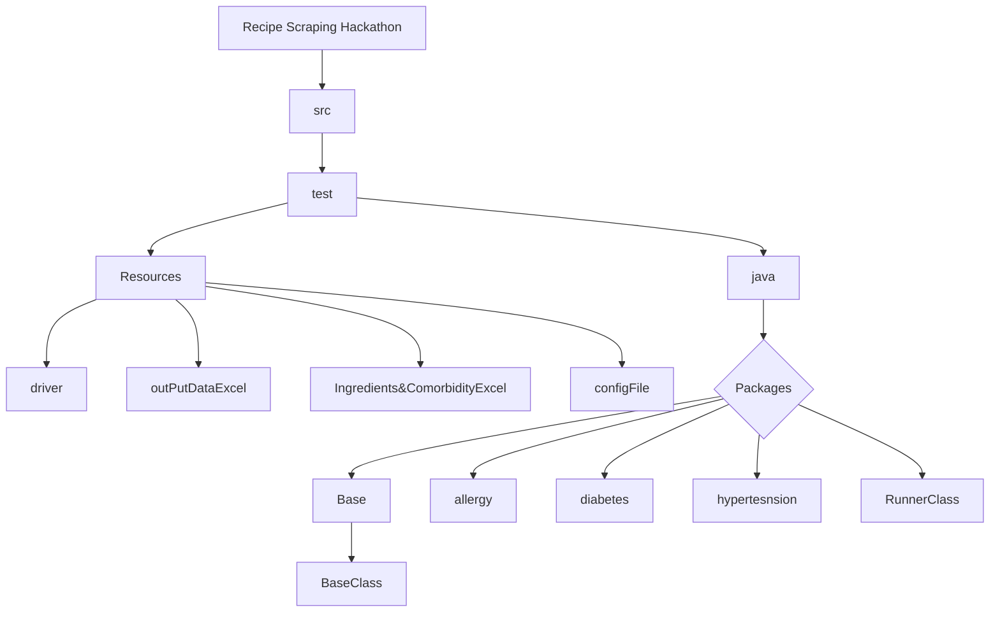

# Recipe_Scraping_Hackathon_April2023_Data_Scrapers_T15
## Purpose

Recipe scraping project holds scripts for scraping the recipes from tarladalal website which contains more than 14,000 recipes. 
The purpose of the hackathon is to extract as many recipes as possible for the patients who are suffering from different medical conditions such as diabetes, hypertension, hypothyriodism and pcos.

## Project Structure

## challenges
1. Passing multiple values as eliminators and collecting output as multiple values.
2. Finding most effective way to reach the recipe page to extract data
3. looping through pages
3. looping through all the letters (A-Z)
4. defining xpaths in a manner that is reusable with each recipe that is being extracted
5. handling exceptions
